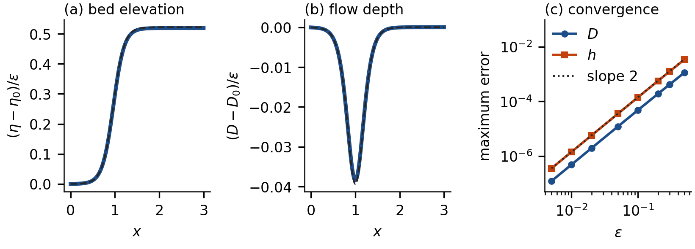
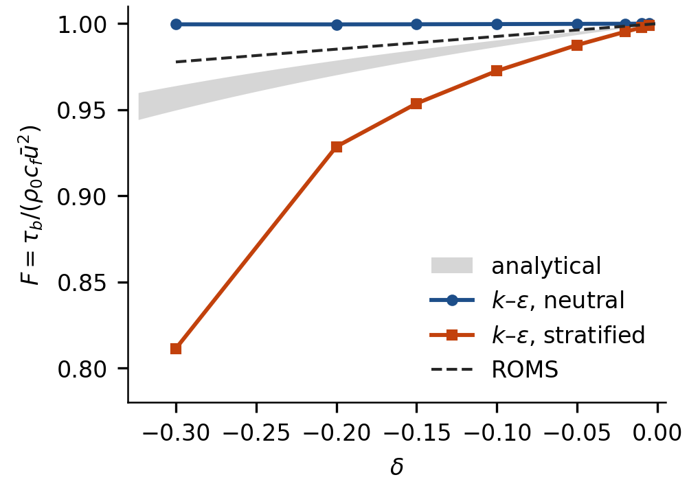
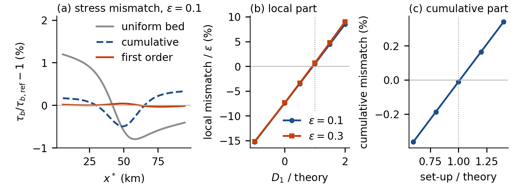

# Density-driven morphodynamic equilibrium of river-dominated estuaries

Code accompanying the paper

> E. Moresco, L. Durante and N. Tambroni, *Morphodynamic equilibrium of river-dominated estuaries
> under a weak longitudinal density gradient*, Physics of Fluids (in preparation).

The repository reproduces the three numerical results of the paper:

| Folder | Paper | What it does | Run time |
|---|---|---|---|
| [`verification/`](verification) | Sec. III B, Fig. 1 | exact solution of Eqs. (9)–(10) compared with the first-order solution, Eq. (13) | seconds |
| [`kepsilon_1dv/`](kepsilon_1dv) | Sec. IV A, Table II, Appendix A, Fig. 2 | one-dimensional vertical k–ε model that tests the friction law, Eq. (7) | ~15 min |
| [`roms/`](roms) | Sec. IV B, Appendix B, Fig. 3 | ROMS configuration and analysis of the equilibrium test | ~20 min (2 cores) |

The outputs of all scripts are stored in [`results/`](results) and [`figures/`](figures), so the figures
can be redrawn without running the models again.

## Quick start

Python 3.9 or later:

```bash
pip install -r requirements.txt
python verification/run_verification.py        # Fig. 1, results/verification.json
python kepsilon_1dv/run_sweep.py               # results/kepsilon_sweep.json
python kepsilon_1dv/run_sensitivity.py         # results/kepsilon_sensitivity.json
python kepsilon_1dv/plot_friction_factor.py    # Fig. 2
python roms/scripts/plot_roms.py               # Fig. 3 from results/roms_equilibrium.json
```

The Python scripts run on Linux, macOS and Windows. Building and running ROMS needs Linux or macOS
(on Windows, WSL), see [below](#3-roms-equilibrium-test-roms).

## 1. Verification of the first-order solution (`verification/`)

In nondimensional form, with the depth $D$ and the free-surface elevation $h$ scaled with the
uniform-flow depth and the landward coordinate $x$ with the backwater length, the equilibrium problem
is (Eqs. 9–10 of the paper)

$$
\frac{\mathrm{d}h}{\mathrm{d}x}\,(1+\delta)=D^{-10/3}F(\delta),\qquad
D^{-11/2}F(\delta)^{5/2}=1,\qquad
\delta=\epsilon\,\frac{D\,G(x)}{\mathrm{d}h/\mathrm{d}x}.
$$

The first equation is the depth-integrated momentum balance with a Strickler friction coefficient; the
second is the equilibrium condition for Engelund–Hansen transport, a sediment flux uniform along the
channel. $\delta$ is the ratio of the baroclinic to the barotropic pressure gradient, $G\le 0$ the
normalized density gradient, $\epsilon$ its peak value and $F(\delta)=(1+\delta)^2/(1+\alpha\delta)^2$
the friction law of Eq. (7), with $\alpha$ given by Eq. (6) for a linear or parabolic eddy viscosity.

At each $x$ the two equations are algebraic in $D$ and $\mathrm{d}h/\mathrm{d}x$. They are solved
exactly, point by point, and $h$ follows by quadrature; no expansion in $\epsilon$ is made. The result
is compared with the first-order solution $D=1+\epsilon D_1$, $h=x+\epsilon h_1$ of Eq. (13), for a
hyperbolic-tangent density transition, $\ln(D/z_0)=9.21$ ($D=10$ m, $z_0=1$ mm) and
$0.005\le\epsilon\le 0.5$.

- `equilibrium_model.py`: friction law, first-order solution, exact solver;
- `run_verification.py`: error table, `results/verification.json`, `figures/fig1_verification.*`.

Expected output: the error decreases as $\epsilon^2$ (observed order 2.00); the relative error of the
depth correction is 1.2, 2.4 and 5.8 % at $\epsilon=0.1$, 0.2 and 0.5 with the linear eddy viscosity
(1.7, 3.4 and 7.9 % with the parabolic one).



## 2. One-dimensional k–ε model (`kepsilon_1dv/`)

A vertical column 10 m deep with bed roughness $z_0=1$ mm, driven by a surface slope and by a
prescribed, depth-uniform horizontal density gradient, integrated to steady state (Appendix A of the
paper). Turbulence follows the standard k–ε model with the buoyancy coefficient of Burchard and
Baumert (1995). In the *neutral* runs the density enters only through the pressure gradient; in the
*stratified* runs the salinity stratification produced by straining is also computed and damps
turbulence. The friction factor $F$ is the ratio of $\tau_b/\bar u^2$ to its value in the barotropic
run with the same slope, and $\gamma_{\rm eff}=(F-1)/\delta$. The boundary values of $k$ and
$\varepsilon$ are imposed inside the implicit solve, so the steady state does not depend on the time
step (checked for $\Delta t=5$, 2.5 and 1.25 s).

- `kepsilon_1dv.py`: the model (equations and closure constants in the docstring);
- `run_sweep.py`: $F(\delta)$ for the neutral case, the stratified case ($c_3=-0.4$, $Pr_t=1$) and two
  stratified variants, plus the threshold beyond which the stratified runs have no steady state;
- `run_sensitivity.py`: grid (50, 100, 200 cells), $c_3$, $Pr_t$ and surface mixing length; amplitude of
  the exchange flow at $\delta=-0.1$;
- `plot_friction_factor.py`: Fig. 2.

Expected output: the barotropic reference has $\bar u=1.03$ m/s and $c_f=2.31\times10^{-3}$.
Without stratification $|\gamma|<0.01$: the k–ε eddy viscosity adjusts to the local stress, which the
baroclinic force increases in the upper water column, and the velocity profile hardly changes. With
stratification $\gamma=0.23$–$0.25$ as $\delta\to0$ and $0.25$–$0.27$ at $\delta=-0.05$
($c_3=-0.4$ to $-0.6$), within 1 % on grids of 50–200 cells; the stratified runs have no steady state
for $\delta\le-0.325$. At $\delta=-0.1$ the departure of the velocity profile from the barotropic one
(exchange flow) is 0.27 % of $\bar u$ without and 1.5–1.7 % with stratification.



## 3. ROMS equilibrium test (`roms/`)

A straight channel 100 km long and 300 m wide, 20 terrain-following levels, k–ε closure of the generic
length-scale formulation with Kantha–Clayson stability functions, logarithmic bed drag with
$z_0=1$ mm, no tide, river velocity 1 m/s. Salinity is nudged, on a time scale of 86 s, to a
hyperbolic-tangent profile with 30 psu at the sea, centred at 50 km, half-width 15 km; the residual
bottom–surface salinity difference is below 0.02 psu. The haline contraction coefficient is set to give
$\epsilon=0.1$ and $0.3$, and to zero in the barotropic twin.

With bed-load (Meyer-Peter and Müller) transport, a bed profile is a morphodynamic equilibrium if and
only if the bed stress it produces is uniform. The test therefore imposes the bed predicted by the theory
on a fixed bed and measures the departure of the bed stress from that of the barotropic twin; the local
($\mathrm{sech}^2$) and cumulative ($\tanh$) parts of the correction are separated by a least-squares fit.
Before the fit, the contribution of a non-Boussinesq term of the ROMS pressure gradient, which the theory
does not contain, is computed from the simulated fields and removed (Appendix B).

Contents:

- `estuary_test.h`: CPP options; the case is built on the ROMS `ESTUARY_TEST` application;
- `Functionals/`: analytical functions that replace the ROMS defaults (grid and bed, initial state,
  boundary conditions, salinity climatology, sediment bed). The changes with respect to ROMS are
  listed in [`roms/CHANGES.md`](roms/CHANGES.md);
- `build_roms.sh`: the ROMS build script, set for a serial gfortran build;
- `scripts/make_run.py`: writes the input files of one run from the ROMS templates;
- `scripts/run_equilibrium_test.py`: the 20 runs of the test;
- `scripts/analyse.py`: all ROMS numbers of the paper, `results/roms_equilibrium.json`;
- `scripts/plot_roms.py`: Fig. 3.

### Build and run

Requirements: gfortran, the NetCDF-Fortran library, make, perl and the Python packages above.
The code is ROMS at revision `57aecf5` of <https://github.com/myroms/roms>; the configuration uses the
unmodified ROMS source.

```bash
git clone https://github.com/myroms/roms.git ~/src/roms
git -C ~/src/roms checkout 57aecf5
export ROMS_ROOT_DIR=~/src          # directory that contains roms/

cd roms
./build_roms.sh -j 2                # creates roms/romsS
cd scripts
python run_equilibrium_test.py --jobs 2
python analyse.py
python plot_roms.py
```

Each run simulates 3 days and takes one to two minutes on one core. The NetCDF output (about 20 MB
per run) is written to `roms/runs/` and is not part of the repository.

Expected output (Sec. IV B): the rms departure of the bed stress at $\epsilon=0.1$ is 0.73 % on the
uniform bed, 0.26 % with the cumulative part only and 0.023 % on the full first-order bed
(2.2, 0.76 and 0.10 % at $\epsilon=0.3$); the local mismatch changes sign at 0.94 and 0.91 times the
amplitude predicted with $\gamma=0.08$, which corresponds to $\gamma=0.074$; with the local part at
this amplitude, the cumulative mismatch vanishes at 1.01 times the theoretical set-up. The 15 runs of
the first stage are bit-for-bit identical to those used for the paper.



## Citation

See [`CITATION.cff`](CITATION.cff). The paper reference will be updated on publication.

## License

MIT, see [`LICENSE`](LICENSE). The files derived from ROMS (`roms/Functionals/`, `roms/estuary_test.h`,
`roms/build_roms.sh`) remain under the ROMS license, reproduced in [`roms/LICENSE_ROMS.md`](roms/LICENSE_ROMS.md).
